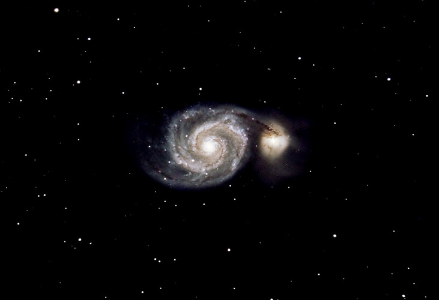

# SIS Gravitational Lens Example 

We are given that a simplified model of the SIS lens equation is given as $$\vec{\beta} = \vec{\theta} - \theta_{E}\hat{\theta}$$
Where $\theta_{E}$ is the Einstein radius of the lens, $\vec{\beta}$ is the angular direction in the source plane, and $\vec{\theta}$ is the direction in the image plane. We can generate images as if they were obscured by an SIS lens. 

This project is an example at implementing this lens equation and generating images of the lensed source. The inputs to this project are a series of sample images of the M51 spiral galaxy. The outputs are the lensed images of the spiral galaxy. All code can be found in `sis.ipynb`.

*Original image of the M51 spiral galaxy*

*Generated GIF of the M51 spiral galaxy, simulating a gravitational lens passing across the screen*
